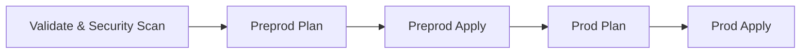

# Azure DevOps Infrastructure & Application Gateway Project

[](https://dev.azure.com)
[](https://www.terraform.io)
[](https://azure.microsoft.com)
[](https://github.com/terraform-linters/tflint)

Automated, modular Infrastructure as Code (IaC) repository built with **Terraform** and integrated into **Azure DevOps CI/CD Pipelines**. Provision enterprise-grade Azure infrastructure across **Preprod** and **Prod** environments with built-in security scanning.

---

## 🏗️ Repository Architecture

```text
AzureDevops/
├── .tflint.hcl                  # TFLint ruleset configuration for AzureRM
├── azure-pipelines.yml          # Multi-stage Azure DevOps CI/CD pipeline
├── README.md                    # Project documentation
├── environments/                # Environment-specific Terraform configurations
│   ├── preprod/
│   │   ├── backend.tf           # Preprod state backend configuration
│   │   ├── main.tf              # Preprod module invocations
│   │   ├── outputs.tf           # Preprod exported outputs
│   │   ├── provider.tf          # AzureRM provider configuration
│   │   ├── terraform.tfvars     # Preprod environment variables & data
│   │   └── variables.tf         # Preprod variable declarations
│   └── prod/
│       ├── backend.tf           # Prod state backend configuration
│       ├── main.tf              # Prod module invocations
│       ├── outputs.tf           # Prod exported outputs
│       ├── provider.tf          # AzureRM provider configuration
│       ├── terraform.tfvars     # Prod environment variables & data
│       └── variables.tf         # Prod variable declarations
└── modules/                     # Reusable Terraform infrastructure modules
    ├── azurerm_application_gateway/   # Azure Application Gateway v2
    ├── azurerm_key_vault/             # Azure Key Vault (RBAC & Soft-delete)
    ├── azurerm_network_interface/     # Azure Network Interfaces (NICs)
    ├── azurerm_network_security_group/# Network Security Groups & Rules
    ├── azurerm_public_ip/             # Standard SKU Static Public IPs
    ├── azurerm_resource_group/        # Azure Resource Groups
    ├── azurerm_storage_account/       # Azure Storage Accounts
    ├── azurerm_subnet/                # Subnets (AGW & Backend)
    └── azurerm_virtual_network/       # Virtual Networks (VNets)
```

---

## 🧩 Infrastructure Modules

| Module Name | Description | Resource Managed |
| :--- | :--- | :--- |
| **[`azurerm_resource_group`](file:///d:/Study/Practice/AzureDevops/modules/azurerm_resource_group)** | Dynamic resource group creation using `for_each` | `azurerm_resource_group` |
| **[`azurerm_virtual_network`](file:///d:/Study/Practice/AzureDevops/modules/azurerm_virtual_network)** | Provision Virtual Networks across regions | `azurerm_virtual_network` |
| **[`azurerm_subnet`](file:///d:/Study/Practice/AzureDevops/modules/azurerm_subnet)** | Provision dedicated subnets (AGW, backend, etc.) | `azurerm_subnet` |
| **[`azurerm_public_ip`](file:///d:/Study/Practice/AzureDevops/modules/azurerm_public_ip)** | Public Static IPs required by Application Gateway v2 | `azurerm_public_ip` |
| **[`azurerm_storage_account`](file:///d:/Study/Practice/AzureDevops/modules/azurerm_storage_account)** | Blob & general storage provisioning | `azurerm_storage_account` |
| **[`azurerm_key_vault`](file:///d:/Study/Practice/AzureDevops/modules/azurerm_key_vault)** | Secure key/secret management with RBAC & soft-delete | `azurerm_key_vault` |
| **[`azurerm_network_interface`](file:///d:/Study/Practice/AzureDevops/modules/azurerm_network_interface)** | Network Interface Cards for compute resources | `azurerm_network_interface` |
| **[`azurerm_network_security_group`](file:///d:/Study/Practice/AzureDevops/modules/azurerm_network_security_group)** | Inbound & Outbound firewall security rules | `azurerm_network_security_group` |
| **[`azurerm_application_gateway`](file:///d:/Study/Practice/AzureDevops/modules/azurerm_application_gateway)** | Enterprise L7 Load Balancer, SSL & Routing | `azurerm_application_gateway` |

---

## 🛡️ Security Tools & Compliance

Automated static analysis and security scanning run on every Pull Request and `main` branch commit via `azure-pipelines.yml`:

- **Gitleaks**: Scans the repository for hardcoded secrets, API tokens, or SSH keys.
- **TFLint**: Validates Terraform syntax, module structure, and AzureRM best practices using [`.tflint.hcl`](file:///d:/Study/Practice/AzureDevops/.tflint.hcl).
- **Terraform Validate & Format**: Guarantees standard formatting and dependency resolution across `preprod` and `prod`.

---

## 🚀 CI/CD Pipeline Workflow

The Azure DevOps pipeline ([`azure-pipelines.yml`](file:///d:/Study/Practice/AzureDevops/azure-pipelines.yml)) executes 5 automated stages:



1. **Validate & Security Scan**: Runs Gitleaks, TFLint, `terraform fmt -check`, and `terraform validate`.
2. **Preprod Plan**: Generates `preprod.tfplan`.
3. **Preprod Apply**: Applies infrastructure changes to Preprod environment upon merge to `main`.
4. **Prod Plan**: Generates `prod.tfplan`.
5. **Prod Apply**: Applies infrastructure changes to Production environment upon approval.

---

## 💻 Local Usage & Testing

### Prerequisites
- [Terraform CLI](https://developer.hashicorp.com/terraform/downloads) `v1.15+`
- [Azure CLI](https://docs.microsoft.com/en-us/cli/azure/install-azure-cli) `v2.x`

### 1. Check Formatting
```powershell
terraform fmt -recursive
```

### 2. Validate Preprod Environment
```powershell
cd environments/preprod
terraform init -backend=false
terraform validate
```

### 3. Validate Prod Environment
```powershell
cd environments/prod
terraform init -backend=false
terraform validate
```

---

## 📜 License
This project is maintained for Azure Infrastructure as Code deployments.